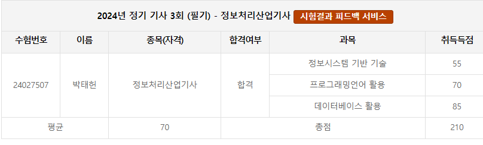

# 2024-1학기 종강 후 스터디 및 앞으로의 계획
 - 정보처리산업기사 필기시험 합격  
 
 - 실기 준비하기 위해 서류 준비하기. (준비완료! 산업인력공단에 서류 직접 제출하기 ~ 8.19 까지)
 - 리액트와 스프링 공부하기
 - 개강까지 (8월 말)

    스터디에서 해야할 내용 정리 (개인 자습도 필요!)

    정보처리산업기사 실기 공부하기.

    Spring 2학기 준비하기.

    개인 프로젝트(프론트엔드) 1, 2개 완료하기.
- 2학기 때 들어야할 학점이 무려 20학점...우짜겠노 해야지
- 그러기 위해서 전공 모든 과목을 다 듣고 교양도 풀로 채워야 함. (수강신청 늦지말기!)
